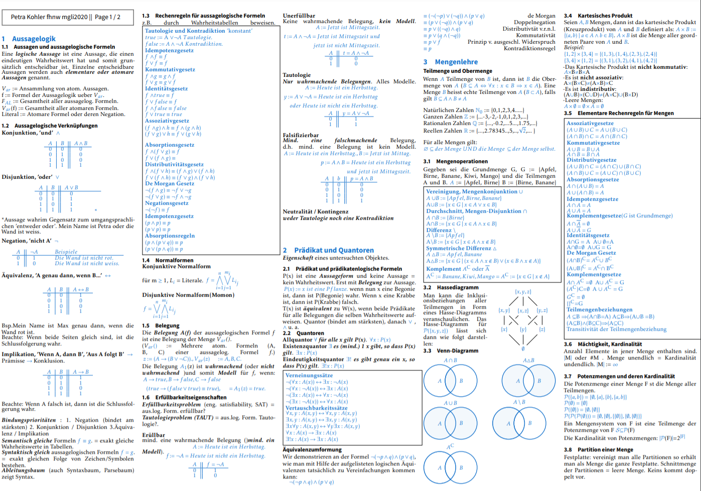
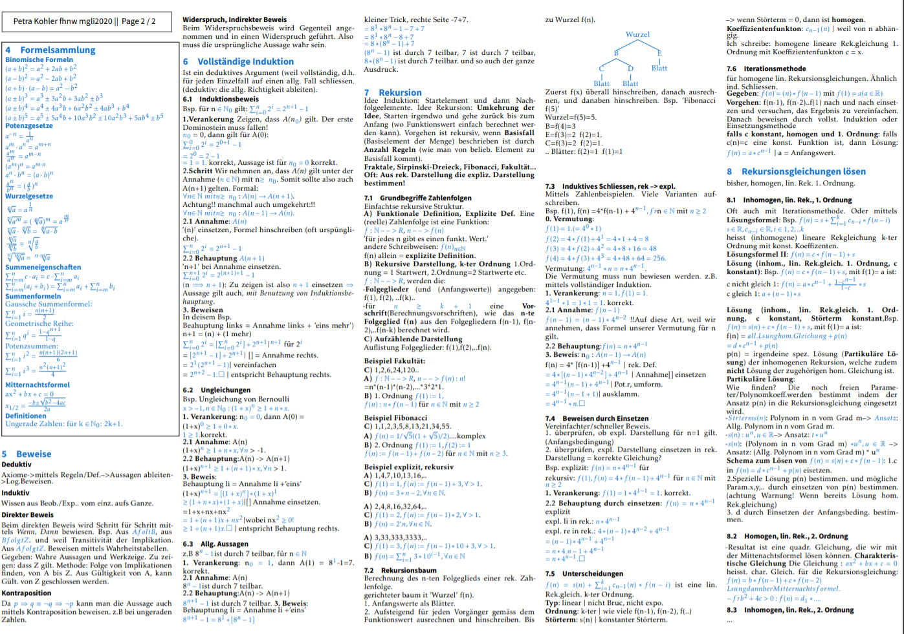
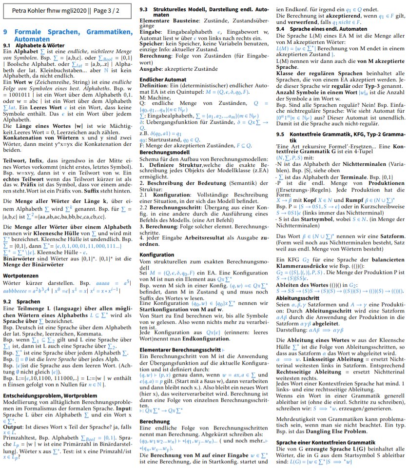
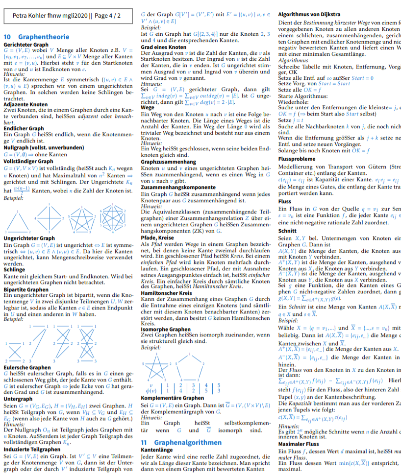
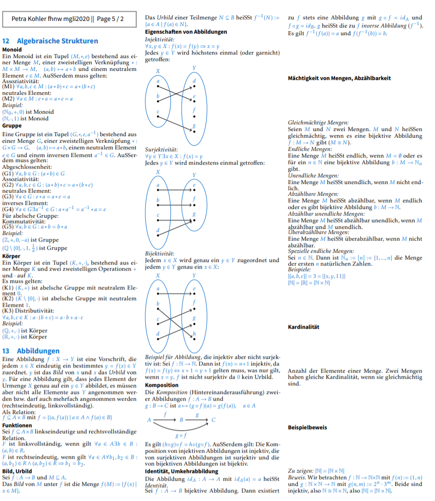

# Compact latex-math-cheatsheet for Computer Science Students

by smuefsmuef@gmail.com
Autumn 2020 - mgli FHNW

basics forked from tim-st/latex-cheatsheet\
thanks!

## topics:

1_aussagelogik\
2_mengen\
A_formelsammlung\
3_beweise\
4_formaleSprachen\
5_graphen\
6_graphalgo\
7_algStrukturen\
8_abbildungen\

## previews

